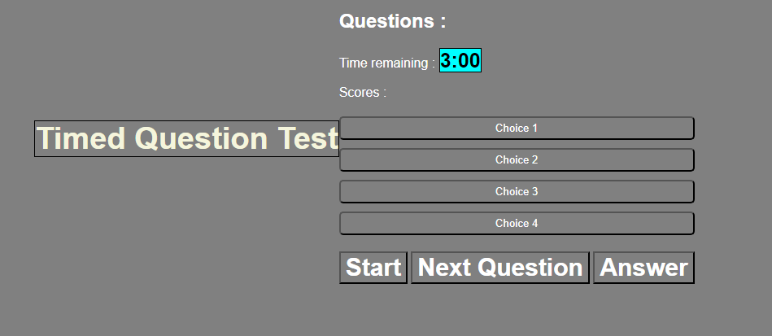

# Questions Quiz by Christopher Joo

## Description

The task at hand was to make a website using HTML, CSS , and JavaScript to make a functioning questions quiz about any random topic. 
The motive behind this was to teSt the students knowledge to build a website from scratch to see how they are able to handle the complications of all three elements learned so far
and make something that functions properly

One of the challenges I faced throughout this work assignment was getting the Javascript to properly function the the HTML webpage. After recalling different elements, id's the webpage did not function and made me definitely hit a "wall". 

Another challenge I personally have is finding ways to simplify my work and assigning different classes or ID's. 

As the project went on, I was able to build a simple page that would display the proper buttons in the HTML function, however using javascript to get  the function to properly work on eventlisteners or the click for buttons and getting questions to prompt currently still give me troubles as a progressing developer. 

## Credits

Credits to the staff and teaching instructors from Columbia University Coding Bootcamp